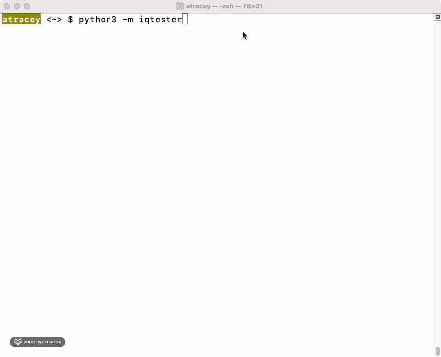
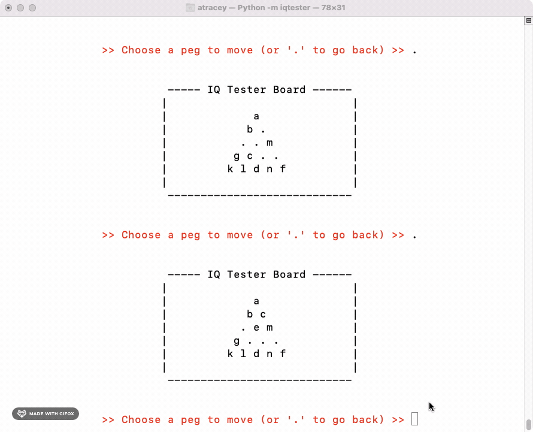
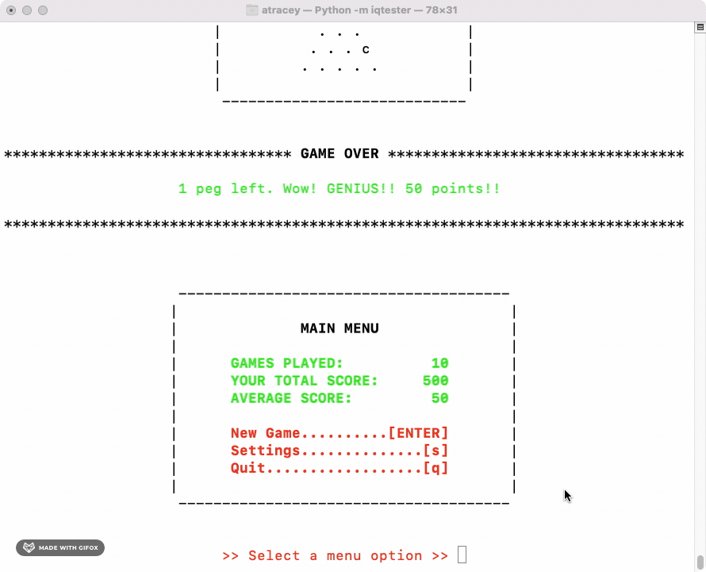

# About
<!-- UPDATE VERSION IN BADGE MANUALLY -->


`iqtester` is a simple command-line version of the classic game "IQ Tester"

[PyPI Home Page](https://pypi.org/project/iqtester/)

# Quick Start

## How to Play

IQ Tester is played on a triangular board, typically with 5 rows of holes and pegs.

Start with any one hole empty. As you jump the pegs remove them from the board.

Try to leave only one peg. See how you rate!

## Support Python Versions

Python 3.7+

## Mac / Linux
```
pip install iqtester
```

## Windows
```
py -m pip install iqtester
```

## Start Playing
```
python3 -m iqtester
```

# Demos

## Gameplay

*A simple (albeit not very successful!) game looks like this.*

*As the game begins, focus on the bottom of the screen to see the current board.*



<br>

## Feature: Undo a Jump (Go Back)

*If you make a mistake, or see a better move, use a period to undo your last move!*


<br>

## Multiple Pegs to Jump

*If you pick a peg that has multiple potential jumps, the possibilities will be highlighted.*

*Choose the peg you'd like to jump over!*



<br>

## Need a Challenge?!

*Maybe you're a **GENIUS** and `iqtester` tells you so over and over again. Kind of like me (I mean look at that score).*

*Once you get over the flattery and are ready to be challenged again, you can make the board size larger.*

*That ought to keep you entertained long enough!*



<br>