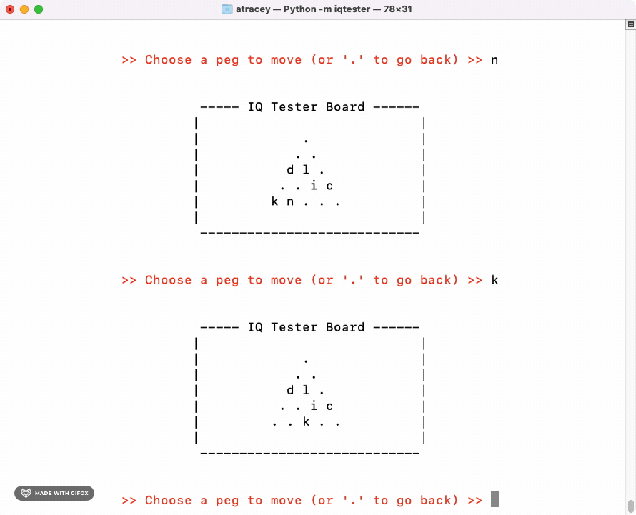

# About
<!-- UPDATE VERSION IN BADGE MANUALLY -->


`iqtester` is a simple command-line version of the classic game "IQ Tester"

[PyPI Home Page](https://pypi.org/project/iqtester/)

# Quick Start

## How to Play

IQ Tester is played on a triangular board, typically with 5 rows of holes and pegs.

Start with any one hole empty. As you jump the pegs remove them from the board.

Try to leave only one peg. See how you rate!

## Support Python Versions

Python 3.7+

## Mac / Linux
```
pip install iqtester
```

## Windows
```
py -m pip install iqtester
```

## Start Playing
```
python3 -m iqtester
```

# Demos

## Gameplay

*A simple (albeit not very successful!) game looks like this.*

*As the game begins, focus on the bottom of the screen to see the current board.*


<br>

## Feature: Undo a Jump (Go Back)

*If you make a mistake, or see a better move, use a period to undo your last move!*



<br>